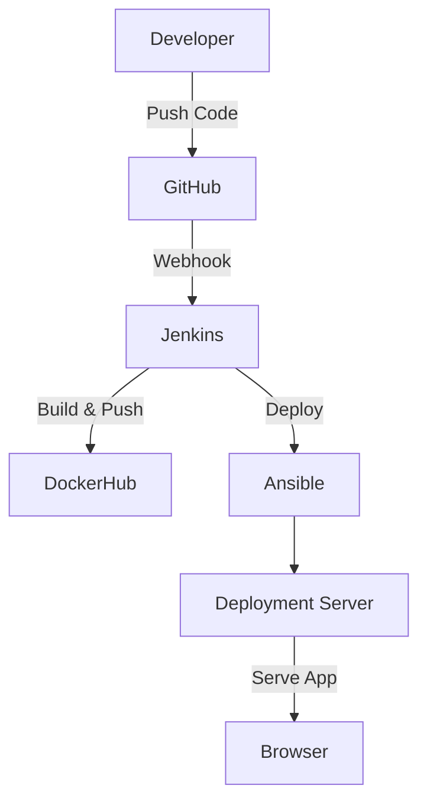

# URL Shortener DevOps Project

This project demonstrates a complete DevOps pipeline for deploying a URL shortener application to AWS EC2 using **Terraform**, **Ansible**, **Docker**, and **Jenkins**.

It covers modern CI/CD practices, Infrastructure as Code, configuration management, and container orchestration.


---

## 🚀 Project Overview

The project automates the entire lifecycle of a URL shortener application:

1. **Infrastructure** – Provision AWS resources (EC2, VPC, Security Groups, Elastic IP) using **Terraform**.
2. **Configuration Management** – Install dependencies, configure servers, and deploy Docker containers with **Ansible**.
3. **Containerization** – Package the app into a **Docker image** and orchestrate services with **docker-compose**.
4. **CI/CD Pipeline** – Automate build, test, and deployment using **Jenkins** with **Blue Ocean** UI.

---

## 🛠️ Tools & Technologies

- **Cloud Provider:** AWS (EC2, Elastic IP)
- **IaC:** Terraform
- **Configuration Management:** Ansible
- **Containerization:** Docker, Docker Compose
- **CI/CD:** Jenkins (Blue Ocean)
- **VCS:** GitHub

---

## ⚙️ Setup Instructions

### 1. Clone the Repository
```bash
git clone https://github.com/4ykh4nCyb3r/url-shortener-devops.git
cd url-shortener-devops
```
### 2. Provision Infrastructure with Terraform
```bash
cd infra
terraform init
terraform plan
terraform apply
```
This will create:
- Jenkins and Deployment servers EC2 instances
- Security groups
- Elastic IP association (⚠️ remember to replace the placeholder Elastic IP in infra/main.tf with yours)

**⚠️ Important: Please take note of your Deployment Server Public IP Address after Terraform finishes. You will need this IP later when accessing the application.**

> ℹ️ **For more information and detailed instructions, please refer to the project documentation.**

### 3. Configure the Jenkins Server with Ansible

After spinning up the Jenkins and deployment servers with Terraform, you need to **install and configure Jenkins on the Jenkins server**. This step ensures Jenkins is properly set up with the required plugins and settings before you proceed with creating pipelines.
```bash
cd ansible-jenkins
ansible-playbook -i inventory.ini ansible-playbook.yml
```
⚠️ **Note:** Since Ansible is a Linux‑native tool, please run it on a Linux distribution or within **Windows Subsystem for Linux (WSL)** to ensure compatibility.

After this step Jenkins will be accessible on the port 8080.

### 4. Manually Configure Jenkins

After Jenkins is installed and accessible, you need to perform some manual setup steps inside the Jenkins UI:

- **Create a new pipeline** for your application.
- **Checkout the code** from GitHub.
- **Install required plugins**, including:
  - Docker
  - Docker Pipeline
  - Docker Compose
- **Configure a GitHub webhook** so that pushes to your repository automatically trigger the pipeline.
- **Add Credentials** which will be used for pushing the image to DockerHub and by Ansible for provisioning deployment server.

Once these steps are complete, Jenkins will be ready to build and deploy your application.

> ℹ️ **For more information and detailed instructions, please refer to the project documentation.**

### 5. GitHub WebHook

To enable automatic builds and deployments whenever you push code to your repository, you need to configure a **GitHub WebHook** that notifies Jenkins:

1. Go to your repository on GitHub.
2. Navigate to **Settings → Webhooks → Add webhook**.
3. In the **Payload URL** field, enter your Jenkins server’s webhook endpoint, for example:
```bash
http://<your-elastic-ip>:8080/github-webhook/
```
4. Set the **Content type** to `application/json`.
5. Choose **Just the push event** (or select additional events if needed).
6. Click **Add webhook** to save.

Once configured, every push to your GitHub repository will trigger the Jenkins pipeline you created in the previous step.

### 6. Trigger the Pipeline

To trigger the Jenkins pipeline, simply make changes to your repository and push them to the branch that your pipeline is configured to watch (e.g., `main` or `develop`).  

This will:
- Notify Jenkins through the GitHub WebHook you configured earlier.
- Automatically start the pipeline build and deployment process.
- Run the defined stages (such as build, push, and deploy) according to your Jenkinsfile.

Once the pipeline completes successfully, your updated application will be deployed.

### 7. Access the Application

Use the **Deployment Server Public IP Address** that you noted earlier after provisioning the infrastructure.  

Open your browser and navigate to:

```bash
http://<deployment-server-public-ip>:3000
```

This will give you access to the running application.

---


## 🔄 CI/CD Workflow

1. Developer pushes code → GitHub
2. Jenkins triggers build
3. Docker image built & pushed to DockerHub
4. Ansible deploys the container to AWS EC2
5. Application is live ✅



## 📈 Future Enhancements
- Add automated tests in pipeline
- Configure monitoring with Prometheus + Grafana
- Enable HTTPS with Nginx reverse proxy + Certbot
- Add auto-scaling with AWS ASG
